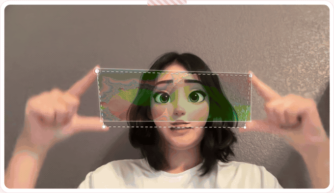
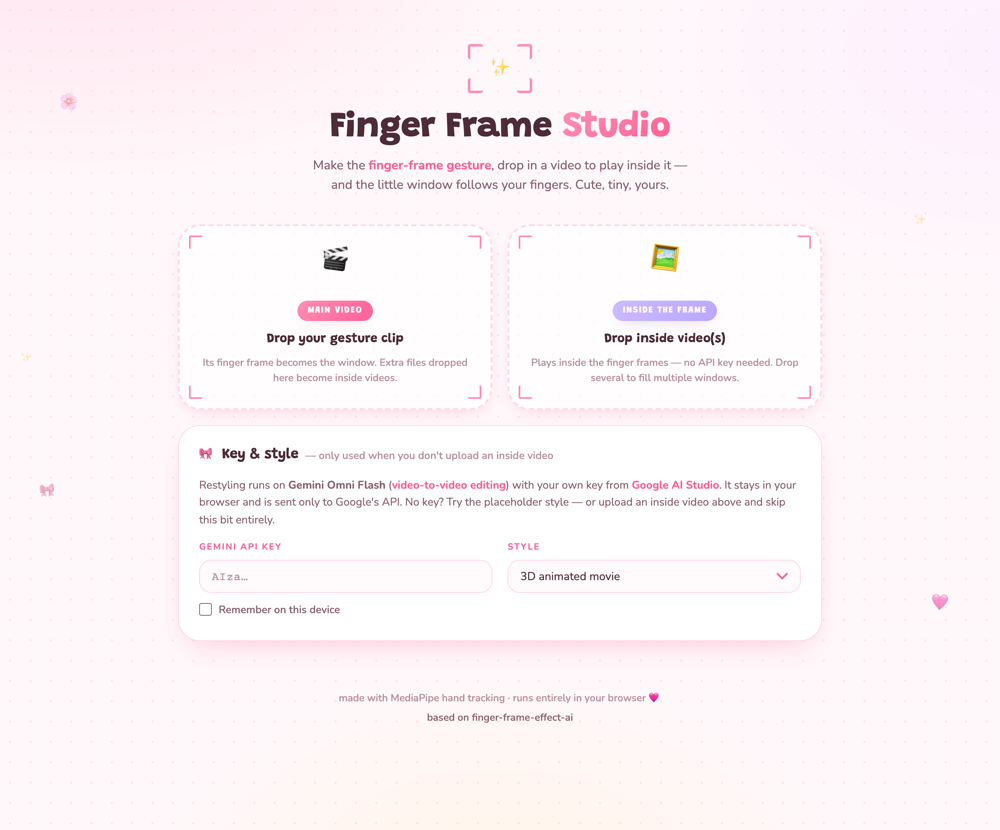
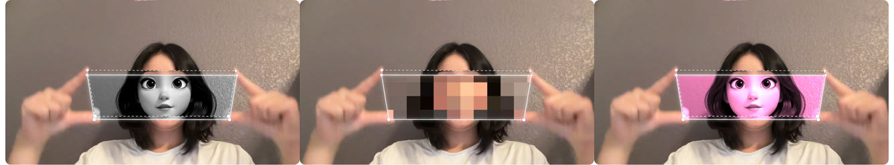

# Finger Frame Studio 🎀

Make the two-hand **finger-frame gesture** on camera, drop your clip in, and
whatever video you choose plays *inside* the frame your fingers make — the
window tracks your hands for the whole take, then exports as a video.

No API key, no model, no account needed for the core flow: you bring the
video that goes inside. The generation step is deliberately pluggable, so
any video-to-video model can fill the window instead.



<p align="center"></p>

## Two ways to fill the window

**1. Bring your own video (default — no key, no waiting).** Upload the
gesture clip as the *main video* and one or more *inside videos*. Each inside
video is revealed through a tracked finger gap. This is the whole app: drop
two files, preview, export.

**2. Restyle with a model (optional).** Leave the inside slot empty and the
**Key & style** panel restyles your clip with
[Gemini Omni Flash](https://ai.google.dev/gemini-api/docs/omni) — 3D animated,
anime, claymation, watercolor, or a custom prompt — then shows the restyled
version through the frame. Every prompt carries a strict-alignment suffix
(same framing, no zoom/crop/recentering, facial features at the same screen
coordinates, expression matched frame by frame) so the result lines up behind
the window. Bring your own [Gemini key](https://aistudio.google.com/apikey);
it stays in your browser and is billed to you. Keep clips under ~15MB.

Uploading an inside video skips the key and style step entirely — the two
paths are mutually exclusive, and the UI follows whichever you started.

## Multi windows

Every **adjacent-fingertip gap** can be its own window: thumb–index,
index–middle, middle–ring, ring–pinky. Toggle **🖐 Multi windows** and two
spread hands become a row of frames, each tracked independently — close two
fingers and just that window closes. With several inside videos loaded, a
**Windows** panel appears so you can assign which video plays in which gap
(Auto cycles them in order).

Multi windows wants palms toward the camera with fingers clearly spread; the
sample clip below has curled fingers, so only the thumb–index window opens
on it. Use your own spread-hand footage to see all four.

## Keyless placeholder styles

No key and nothing to put inside? Three built-in looks run the full
track → composite → export pipeline for free:



**🖤 B&W** grayscale · **🧩 Mosaic** a real pixelate (chunky blocks, good for
hiding a face) · **🌸 Blush** pink duotone.

## Tracking and export

Hand tracking is MediaPipe Hand Landmarker running in the browser (WASM/GPU
via CDN), with the audited quad pipeline from the original live app:
anatomical corner ordering, spread and area gates with hysteresis, teleport
rejection, velocity-adaptive smoothing, dropout hold and presence fade. Each
window is drawn with a solid glowing white outline and pulsing corner dots.

Preview is pausable (click the button or the video). Export records the
canvas to MP4 where the browser supports it (Safari, newer Chrome) and WebM
otherwise — convert with
`ffmpeg -i finger-frame-ai.webm -c:v libx264 out.mp4`. Exports use the
video's full resolution regardless of how large the preview appears.

## Run locally

It's plain HTML and vanilla ES modules — no build step, no dependencies to
install, no server-side anything:

```bash
python3 -m http.server 8124
```

Then open http://localhost:8124. Dev query params load files from the server
directory: `?src=clip.mp4` for the main video and `?inside=world.mp4`
(repeatable) for inside videos.

## CLI alternative (Python)

For batch work or frame-accurate H.264 output. Note the CLI is the older
single-window Gemini path — it has no multi-window or per-window assignment:

```bash
python3 -m venv .venv
.venv/bin/pip install -r requirements.txt

export GEMINI_API_KEY=...
.venv/bin/python stylize.py input.mp4 -o stylized.mp4      # AI restyle
.venv/bin/python composite.py input.mp4 stylized.mp4 -o final.mp4
```

`composite.py` is model-agnostic: hand it *any* aligned stylized video —
including one generated elsewhere — and it tracks the original and
composites. It needs `ffmpeg` on PATH, outputs H.264 MP4, and carries over
the original audio.

## Roadmap

- Higgsfield video-to-video as a first-class generation option (via MCP),
  alongside Gemini
- Multi-window support in the CLI path

## Credits and notes

Based on [finger-frame-effect-ai](https://github.com/sophiamyang/finger-frame-effect-ai)
by [Sophia Yang](https://github.com/sophiamyang), which contributed the
original tracking pipeline and the Gemini restyle path. Upstream ships no
license, so this repo is kept private.

- `examples/final.mp4` is upstream's sample footage, reused here as the demo
  clip. It is their *rendered output*, so it already has their dashed frame
  and dots burned in — that faint second outline in the examples above comes
  from the clip, not from this app.
- Your own inputs and outputs are gitignored; only the files under
  `examples/` are committed.
